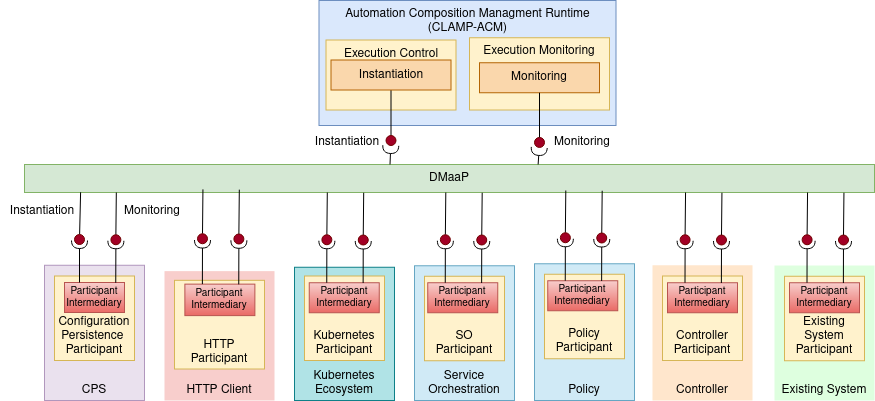

# [Automation Composition Participants](#automation-composition-participants)

A Participant is a component that acts as a bridge between the CLAMP Automation Composition Management runtime and components such as the Policy Framework, DCAE, or a Kubernetes cluster that are taking part in automation composition management. It listens to DMaaP to receive messages from the CLAMP runtime and performs operations towards components that are taking part in acms. A participant has an Automation Composition Management Element for each automation composition in which it is taking part.

The implementation of a participant may use a common [Participant Intermediary library](https://adp.ericsson.se/marketplace/automation-composition-mgmt-runtime/documentation/development/additional-documents/participant-intermediary), which carries out common message and state handling for Automation Composition Elements in participants. The _ParticipantImplementation_ is the component specific implementation of a participant, which is specifically developed for each component that wishes to take part in automation composition management.

The figure above shows participants for various components that may take part in automation composition management.

---

**Note:**

The figure above is for illustration. Not all the participants mentioned above have realizations in ONAP. Some of the participants in the figure above represent a type of participant. For example, a controller participant would be written for a specific controller such as CDS and a participant for an existing system would be written towards that existing system.

---

The detailed implementation of the CLAMP Participant ecosystem is described on the following pages:

*   [Participant Intermediary](https://adp.ericsson.se/marketplace/automation-composition-mgmt-runtime/documentation/development/additional-documents/participant-intermediary)
*   [HTTP Participant](https://docs.onap.org/projects/onap-policy-parent/en/latest/clamp/acm/design-impl/participants/http-participant.html)
*   [Kubernetes Participant](https://docs.onap.org/projects/onap-policy-parent/en/latest/clamp/acm/design-impl/participants/k8s-participant.html)
*   [A1PMS Participant](https://docs.onap.org/projects/onap-policy-parent/en/latest/clamp/acm/design-impl/participants/a1pms-participant.html)
*   [Kserve Participant](https://docs.onap.org/projects/onap-policy-parent/en/latest/clamp/acm/design-impl/participants/kserve-participant.html)
*   [The CLAMP Policy Framework Participant](https://docs.onap.org/projects/onap-policy-parent/en/latest/clamp/acm/design-impl/participants/policy-framework-participant.html)
