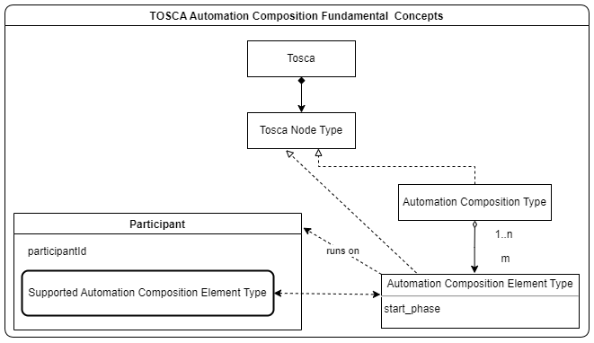
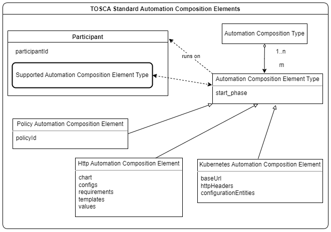
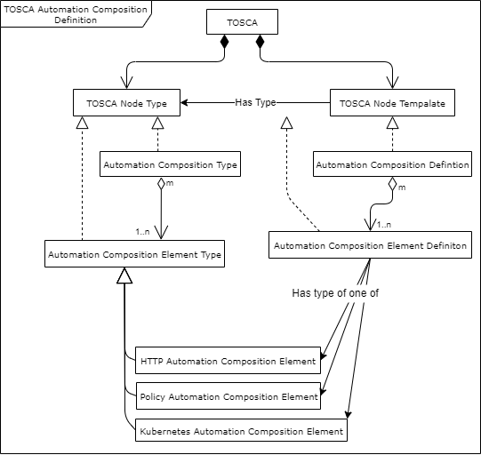
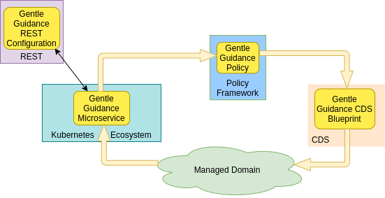

# [Defining Automation Compositions](#defining-automation-compositions)

## Contents
*   [Defining Automation Compositions](#defining-automation-compositions)

    *   [1 Standard TOSCA Service Template Concepts for Automation Compositions](#1-standard-tosca-service-template-concepts-for-automation-compositions)

        *   [1.1 Fundamental TOSCA Concepts for Automation Compositions](#11-fundamental-tosca-concepts-for-automation-compositions)

        *   [1.2 TOSCA Concepts for Automation Composition Elements delivered by ONAP](#12-tosca-concepts-for-automation-composition-elements-delivered-by-onap)

            *   [1.2.1 Policy Automation Composition Element](#121-policy-automation-composition-element)

            *   [1.2.2 HTTP Automation Composition Element](#122-http-automation-composition-element)

            *   [1.2.3 Kubernetes Automation Composition Element](#123-kubernetes-automation-composition-element)

    *   [2 Common and Instance Specific Properties](#2-common-and-instance-specific-properties)

        *   [2.1 Terminology for Properties](#21-terminology-for-properties)

        *   [2.2 Common Properties](#22-common-properties)

        *   [2.3 Instance Specific Properties](#23-instance-specific-properties)

    *   [3 Writing a Automation Composition Type Definition](#3-writing-a-automation-composition-type-definition)

        *   [3.1 The Gentle Guidance Automation Composition](#31-the-gentle-guidance-automation-composition)

        *   [3.2 The TOSCA Automation Composition Definition](#32-the-tosca-automation-composition-definition)

    *   [4 Creating Custom Automation Composition Elements](#4-creating-custom-automation-composition-elements)

---

* Automation Composition: A set of elements working together to deliver a feature or function.

* Automation Composition Type Definition: A formal definition of a type of an Automation Composition in the TOSCA modelling language (described in JSON or YAML), which specifies the type and properties of elements that make up an Automation Composition and the types of participants that host those elements

* Automation Composition Type: An Automation Composition type, which has been created (commissioned) in the ACM runtime server

* Automation Composition Instance: An instance of an Automation Composition Type, which as been created in the ACM runtime server. The elements of an Automation Composition Instance run on participants. The collection of all the Automation Composition Element Instances make up an Automation Composition Instance.

An Automation Composition Type is defined in a TOSCA service template. A TOSCA Service Template has two parts: a definition part in the service template itself, which contains the definitions of concepts that can be used to define the types of concepts that can appear on a Topology Template and a Topology Template that defines a topology. See the [Oasis Open TOSCA](https://docs.oasis-open.org/tosca/TOSCA-Simple-Profile-YAML/v1.3/) web page for more details on TOSCA.

Unsurprisingly, to define a Automation Composition Type in TOSCA, of Automation Composition related concepts that we can use in all automation compositions exist. They are described in Section 1. Section 2 describes how properties are managed. Properties are the configuration parameters that are provided to Automation Compositions and the Automation Composition Elements they use. Section 3 describes how to define a Automation Composition using the predefined Automation Composition concepts.

---

## [1 Standard TOSCA Service Template Concepts for Automation Compositions](#standard-tosca-service-template-concepts-for-automation-compositions)

These concepts are the base concepts available to users who write definitions for automation compositions in TOSCA. TOSCA automation composition definitions are written using these concepts.

### [1.1 Fundamental TOSCA Concepts for Automation Compositions](#fundamental-tosca-concepts-for-automation-compositions)

The following TOSCA concepts are the fundamental concepts in a TOSCA Service Template for defining automation compositions.



The TOSCA concepts above may be declared in the TOSCA Service Template of a automation composition. If the concepts already exist in the Design Time Catalogue or the Runtime Inventory, they may be omitted from a TOSCA service template that defines a automation composition type.

The _start\_phase_ is a value indicating the start phase in which this automation composition element will be started, the first start phase is zero. Automation Composition Elements are started in their _start\_phase_ order and stopped in reverse start phase order. Automation Composition Elements with the same start phase are started and stopped simultaneously.

The Yaml file that holds the Definition of [TOSCA fundamental Automation Composition Types is available in Github](https://github.com/onap/policy-clamp/blob/master/common/src/main/resources/tosca/AutomationCompositionTOSCAServiceTemplateTypes.yaml) and is the canonical definition of the Automation Composition concepts.

### [1.2 TOSCA Concepts for Automation Composition Elements delivered by ONAP](#tosca-concepts-for-automation-composition-elements-delivered-by-onap)

TOSCA Standard Automation Composition Elements

[]

*   **Automation Composition Element Type Definition:** A formal definition of a type of an Automation Composition element in an Automation Composition Type Definition.

*   **Automation Composition Element Type:** An Automation Composition element type in an Automation Composition type, which has been created (commissioned) in the ACM runtime server

*   **Automation Composition Element Instance:** An instance of an Automation Composition Element, which can run on an Participant

*   **Participant:** A component that agrees to run elements of Automation Compositions. Therefore, participants agree to be part of Automation Composition Instances. Participants of a particular type can run Automation Composition Elements of specific types.


#### [1.2.1 Policy Automation Composition Element](#policy-automation-composition-element)

The Policy Participant runs Policy Automation Composition Elements. Each Policy Automation Composition Element manages the deployment of the policy specified in the Policy Automation Composition Element definition. The Yaml file that holds the [Policy Automation Composition Element Type definition is available in Github](https://github.com/onap/policy-clamp/blob/master/common/src/main/resources/tosca/PolicyAutomationCompositionElementType.yaml) and is the canonical definition of the Policy Automation Composition Element type. For a description of the Policy Automation Composition Element and Policy Participant, please see [The CLAMP Policy Framework Participant](https://docs.onap.org/projects/onap-policy-parent/en/latest/clamp/acm/design-impl/participants/policy-framework-participant.html) page.

#### [1.2.2 HTTP Automation Composition Element](#http-automation-composition-element)

The HTTP Participant runs HTTP Automation Composition Elements. Each HTTP Automation Composition Element manages REST communication towards a REST endpoint using the REST calls a user has specified in the configuration of the HTTP Automation Composition Element. The Yaml file that holds the [HTTP Automation Composition Element Type definition is available in Github](https://github.com/onap/policy-clamp/blob/master/common/src/main/resources/tosca/PolicyAutomationCompositionElementType.yaml) and is the canonical definition of the HTTP Automation Composition Element type. For a description of the HTTP Automation Composition Element and HTTP Participant, please see [The CLAMP HTTP Participant](https://docs.onap.org/projects/onap-policy-parent/en/latest/clamp/acm/design-impl/participants/http-participant.html) page.

#### [1.2.3 Kubernetes Automation Composition Element](#kubernetes-automation-composition-element)

The Kubernetes Participant runs Kubernetes Automation Composition Elements. Each Kubernetes Automation Composition Element manages a Kubernetes microservice using Helm. The user defines the Helm chart for the Kubernetes microservice as well as other properties that the microservice requires in order to execute. The Yaml file that holds the [Kubernetes Automation Composition Element Type defintion is available in Github](https://github.com/onap/policy-clamp/blob/master/common/src/main/resources/tosca/KubernetesAutomationCompositionElementType.yaml) and is the canonical definition of the Kubernetes Automation Composition Element type. For a description of the Kubernetes Automation Composition Element and Kubernetes Participant,please see [The CLAMP Kubernetes Participant](https://docs.onap.org/projects/onap-policy-parent/en/latest/clamp/acm/design-impl/participants/k8s-participant.html) page.

## [2 Common and Instance Specific Properties](#common-and-instance-specific-properties)

Properties are used to define the configuration for Automation Compositions and Automation Composition Elements. At design time, the types, constraints, and descriptions of the properties are specified. The values for properties are specified in Automation Composition Instance. TOSCA provides support for defining properties, see [Section 3.6.10: TOSCA Property Definition](https://docs.oasis-open.org/tosca/TOSCA-Simple-Profile-YAML/v1.3/os/TOSCA-Simple-Profile-YAML-v1.3-os.html#DEFN_ELEMENT_PROPERTY_DEFN) in the TOSCA documentation.

### [2.1 Terminology for Properties](#terminology-for-properties)

* **Property:** Metadata defined in TOSCA that is associated with a Automation Composition, a Automation Composition Element, or a Participant.

* **TOSCA Property Type:** The TOSCA definition of the type of a property. A property can have a generic type such as string or integer or can have a user defined TOSCA data type.

* **TOSCA Property Value:** The value of a Property Type.

* **Common Property Type:** Property Types that apply to all instances of a Automation Composition Type.

* **Common Property Value:** The value of a Property Type. It is assigned in Automation Composition Definition once for all instances of a Automation Composition Type.

* **Instance Specific Property Type:** Property Types that apply to all instances of a specific Automation Composition Type.

* **Instance Specific Property Value:** The value of a Property Type that applies to an individual instance of a Instance Specific Property Type. The value is assigned in Automation Composition Instance.

---
**Note:

Automation Composition Properties can be _common_ or _instance specific_. See the Overview Section of the [Service User Guide](https://adp.ericsson.se/marketplace/automation-composition-mgmt-runtime/documentation/development/dpi/service-user-guide#overview) for a detailed description of the usage of common and instance specific properties.

---

### [2.2 Common Properties](#common-properties)
Common properties apply to all instances of a automation composition. Common properties are identified by a special metadata flag in Automation Composition and Automation Composition Element definitions. For example, the startPhase parameter on any Automation Composition Element has the same value for any instance of that automation composition element, so it is defined as shown below in the [Definition of TOSCA fundamental Automation Composition Types](https://github.com/onap/policy-clamp/blob/master/common/src/main/resources/tosca/AutomationCompositionTOSCAServiceTemplateTypes.yaml) yaml file.

```yaml
startPhase:
  type: integer
  required: false
  constraints:
  - greater-or-equal: 0
  description: A value indicating the start phase in which this automation composition element will be started, the
              first start phase is zero. Automation Composition Elements are started in their start_phase order and stopped
              in reverse start phase order. Automation Composition Elements with the same start phase are started and
              stopped simultaneously
  metadata:
    common: true
```

The “common: true” value in the metadata of the startPhase property identifies that property as being a common property. This property will be set during automation composition commissioning.

### [2.3 Instance Specific Properties](#instance-specific-properties)

Instance Specific properties apply to individual instances of a Automation Composition and/or Automation Composition Element and must be set individually for Automation Composition and Automation Composition Element instance. Properties are instance specific by default, but can be identified by a special metadata flag in Automation Composition and Automation Composition Element definitions. For example, the chart parameter on a Kubernetes Automation Composition Element has a different value for every instance of a Kubernetes Automation Composition Element, so it can be defined as shown below in the [Kubernetes Automation Composition Type definition](#123-kubernetes-automation-composition-element) yaml file.

```yaml
# Definition that omits the common flag metadata
chart:
  type: org.onap.datatypes.policy.clamp.acm.kubernetesAutomationCompositionElement.Chart
  typeVersion: 1.0.0
  description: The helm chart for the microservice
  required: true

# Definition that specifies the common flag metadata
chart:
  type: org.onap.datatypes.policy.clamp.acm.kubernetesAutomationCompositionElement.Chart
  typeVersion: 1.0.0
  description: The helm chart for the microservice
  required: true
  metadata:
    common: false
```

The “common: false” value in the metadata of the chart property identifies that property as being an instance specific property. This property will be set during automation composition instantiation.

## [3 Writing an Automation Composition Type Definition](#writing-an-automation-composition-type-definition)

The TOSCA definition of an automation composition contains a TOSCA Node Template for the automation composition itself, which contains TOSCA Node Templates for each Automation Composition Element that makes up the Automation Composition.

[]

To create a automation composition, a user creates a TOSCA Topology Template. In the Topology Template, the user creates a TOSCA Node Template for each Automation Composition Element that will be in the Automation Composition Definition. Finally, the user creates the Node Template that defines the Automation Composition itself, and references the Automation Composition Element definitions that make up the Automation Composition Definition.

### [3.1 The Gentle Guidance Automation Composition](#the-gentle-guidance-automation-composition)

The best way to explain how to create an Automation Composition Definition is by example.

]

The example Gentle Guidance automation composition is illustrated in the diagram above. The domain logic for the automation composition is implemented in a microservice running in Kubernetes, a policy, and some configuration that is passed to the microservice over a REST endpoint. We want to manage the life cycle of the domain logic for our Gentle Guidance automation composition using our TOSCA based Automation Composition Life Cycle Management approach. To do this we create four Automation Composition Element definitions, one for the Kubernetes microservice, one for the policy and one or the REST configuration.

### [3.2 The TOSCA Automation Composition Definition](#the-tosca-automation-composition-definition)

We use a TOSCA Topology Template to specify a Automation Composition definition and the definitions of its Automation Composition Elements. Optionally, we can specify default parameter values in the TOSCA Topology Template. The actual values of Automation Composition common and instance specific parameters are set in Automation Composition Instance.

In the case of the Gentle Guidance automation composition, we define a Automation Composition Element Node Template for each part of the domain logic we are managing. We then define the Automation Composition Node Template for the automation composition itself.

Please refer to the [No Properties yaml file in Github](https://github.com/onap/policy-clamp/blob/cbd4d5dbe88928d5765e9749987f6b93f2b347e9/examples/src/main/resources/clamp/acm/gentleguidance/GentleGuidanceNoProperties.yaml) for the definitive Yaml specification for the TOSCA Topology Template for the Gentle Guidance domain when no parameters are defined.

Please refer to the [Default Properties yaml file in Github](https://github.com/onap/policy-clamp/blob/cbd4d5dbe88928d5765e9749987f6b93f2b347e9/examples/src/main/resources/clamp/acm/gentleguidance/GentleGuidanceDefaultProperties.yaml) for the definitive Yaml specification for the TOSCA Topology Template for the Gentle Guidance domain when the default values of parameters are defined.

## [4 Creating Custom Automation Composition Elements](#creating-custom-automation-composition-elements)

Any organization can include their own component in the framework and use the framework and have the Policy Framework CLAMP manage the lifecycle of domain logic in their component as part of a Automation Composition. To do this, a participant for the component must be developed that allows Automation Composition Elements for that component to be run. To develop a participant, the participant must comply with the [CLAMP Participants](https://adp.ericsson.se/marketplace/automation-composition-mgmt-runtime/documentation/development/additional-documents/automation-composition-participants) framework and in particular comply with [The CLAMP Automation Composition Participant Protocol](https://adp.ericsson.se/marketplace/automation-composition-mgmt-runtime/documentation/development/additional-documents/participant-protocol). The organization must also specify a new Automation Composition Element type definition in TOSCA similar to those supplied in ONAP and described in Section 1.2. This Automation Composition Element type tells the CLAMP Automation Composition Lifecycle management that the Automation Composition Element exists and can be included in automation compositions. It also specifies the properties that can be specified for the Automation Composition Element.

An organization can supply the code for the Participant (for example as a Java jar file) and a TOSCA artifact with the Automation Composition Element definition and it can be added to the platform. In future releases, support will be provided to include participants and their Automation Composition Element definitions as packaged plugins that can be installed on the platform.
