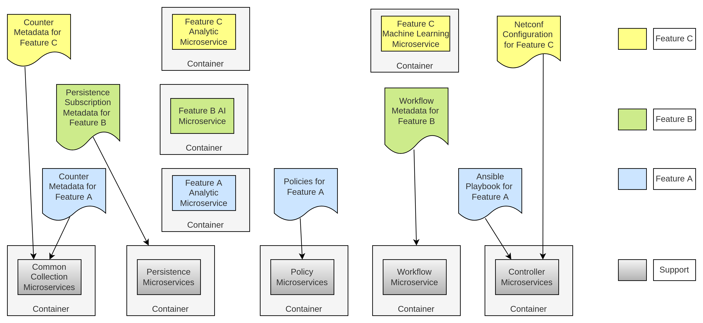
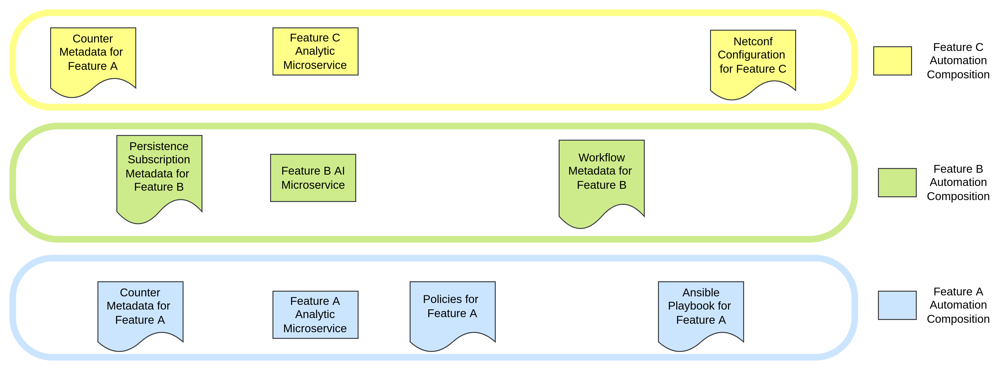
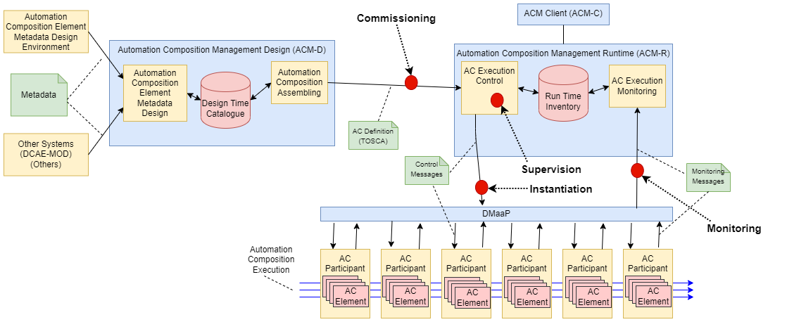
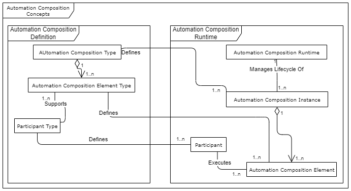
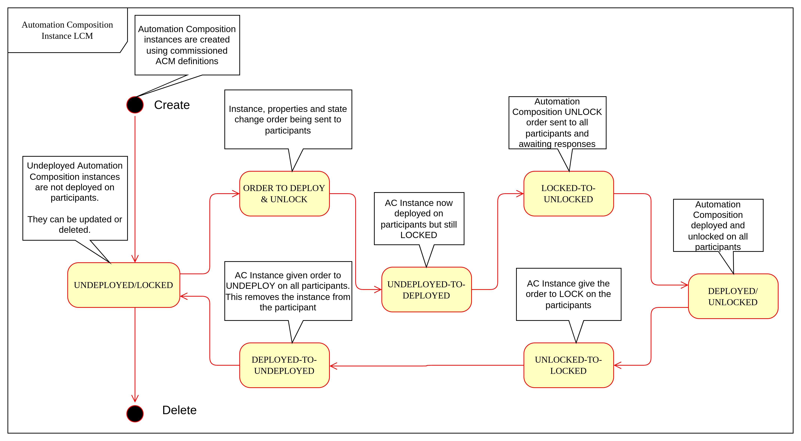
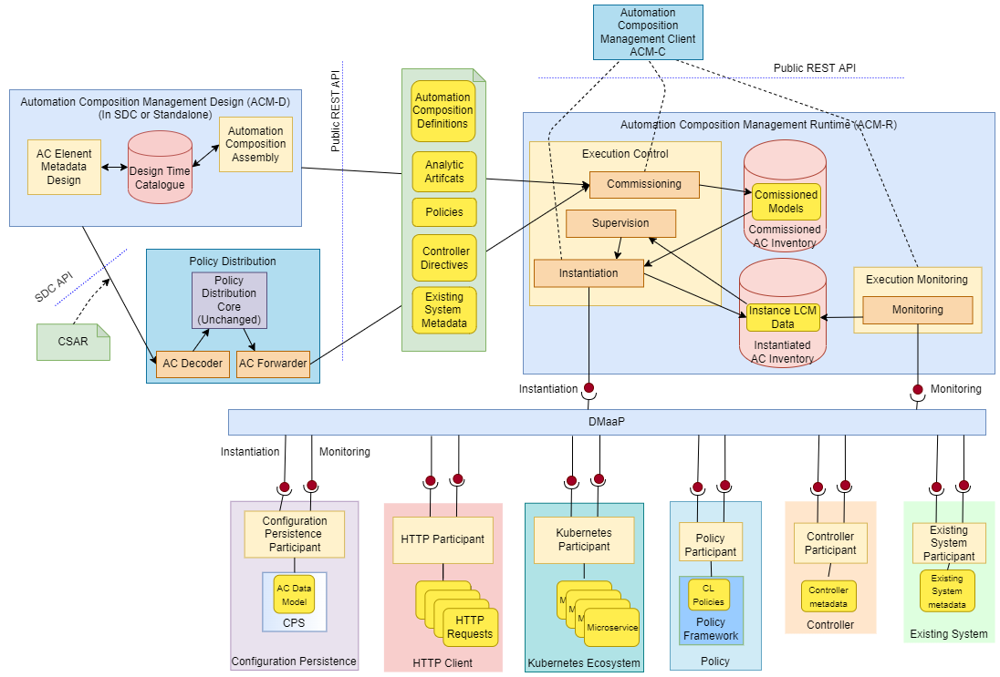
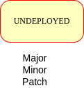
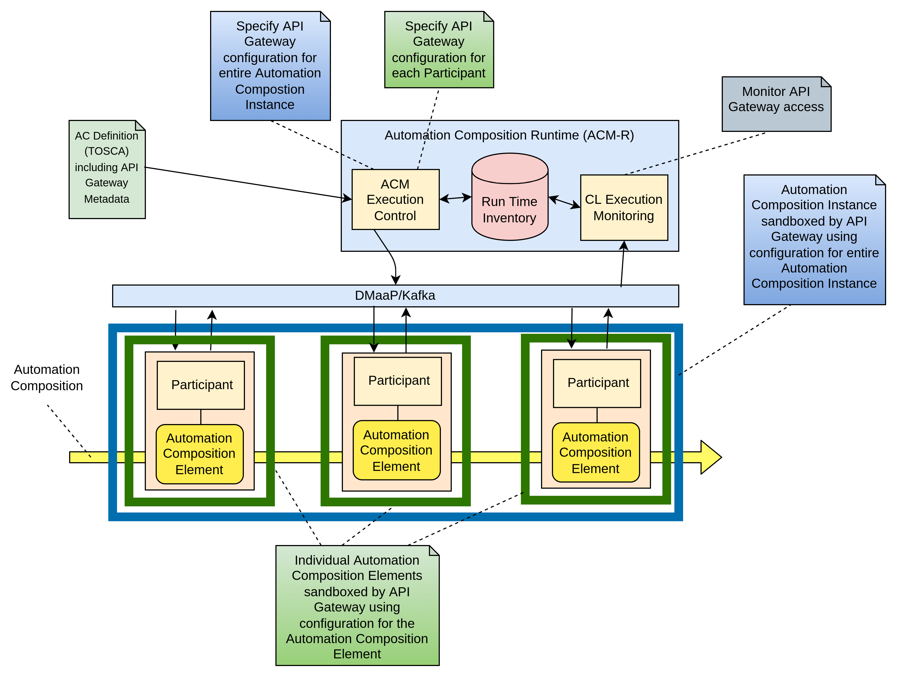

# [ACM User Guide](#acm-user-guide)
## Contents
<!-- TOC -->
* [ACM User Guide](#acm-user-guide)
  * [Contents](#contents)
  * [Overview](#overview)
    * [1 Introduction](#1-introduction)
    * [2 Terminology](#2-terminology)
      * [2.1 Automation Composition Terminology](#21-automation-composition-terminology)
      * [2.2 Participant Terminology](#22-participant-terminology)
      * [2.3 Terminology for Properties](#23-terminology-for-properties)
      * [2.4 Concepts and their relationships](#24-concepts-and-their-relationships)
    * [3 Capabilities](#3-capabilities)
      * [3.1 Automation Composition Instance States](#31-automation-composition-instance-states)
    * [4 Overall Target Architecture](#4-overall-target-architecture)
    * [5. Other Considerations](#5-other-considerations)
      * [5.1 Management of Automation Composition Instance Configurations](#51-management-of-automation-composition-instance-configurations)
      * [5.2 Scalability](#52-scalability)
      * [5.3 Sandboxing and API Gateway Support](#53-sandboxing-and-api-gateway-support)
    * [6 APIs and Protocols](#6-apis-and-protocols)
    * [7 Design and Implementation](#7-design-and-implementation)
  * [Deployment](#deployment)
    * [1. Prerequisites](#1-prerequisites)
    * [2. Deployment in a Kubernetes Environment Using Helm](#2-deployment-in-a-kubernetes-environment-using-helm)
      * [2.1. Preparation](#21-preparation)
      * [2.2 Install Postgres Document Database](#22-install-postgres-document-database)
      * [2.3 Installation of the Strimzi Kafka Operator](#23-installation-of-the-strimzi-kafka-operator)
      * [2.4 Installation of the ACM-R Microservice](#24-installation-of-the-acm-r-microservice)
    * [3. Configuration Paramters](#3-configuration-paramters)
      * [3.1 Global Params](#31-global-params)
      * [3.2 Microservice Params](#32-microservice-params)
  * [4. Secrets](#4-secrets)
    * [4.1 Secrets Array Possible Parameters](#41-secrets-array-possible-parameters)
      * [Values.yaml Secrets](#valuesyaml-secrets)
      * [Standalone-values.yaml Secrets](#standalone-valuesyaml-secrets)
    * [5. Service Dimensioning](#5-service-dimensioning)
      * [5.1 Override Default Dimensioning Configuration](#51-override-default-dimensioning-configuration)
      * [5.2 Use Max (Default) Configuration per Service Instance](#52-use-max--default--configuration-per-service-instance)
    * [6. Hardening](#6-hardening)
    * [7. Upgrade Procedure](#7-upgrade-procedure)
      * [7.1 Execute the Upgrade](#71-execute-the-upgrade)
      * [7.2 Verify the Availability of ACM-R After Upgrade](#72-verify-the-availability-of-acm-r-after-upgrade)
  * [Security Guidelines](#security-guidelines)
    * [1. Operative Tasks](#1-operative-tasks)
    * [2. External Ports](#2-external-ports)
    * [3. Internal Ports](#3-internal-ports)
    * [4. Certificates](#4-certificates)
    * [5. Security Events That Can Be Logged](#5-security-events-that-can-be-logged)
    * [Privacy User Guidelines](#privacy-user-guidelines)
  * [Troubleshooting](#troubleshooting)
    * [Strimzi Operator Fails to Create Cluster](#strimzi-operator-fails-to-create-cluster)
    * [Service Mesh Fails to Allocate Sidecars](#service-mesh-fails-to-allocate-sidecars)
    * [Logging of the ACM-R Service](#logging-of-the-acm-r-service)
    * [Bug Reporting and Additional Support](#bug-reporting-and-additional-support)
      * [Additional Support](#additional-support)
      * [Bug Reporting](#bug-reporting)
<!-- TOC -->

## [Overview](#overview)
To get a feature, service, or capability working in modern networks is not straightforward. It is not as simple as deploying a microservice or running a workflow. Our features, services, and capabilities are now typically delivered using loose compositions of microservices, rules, algorithms, configurations, and workflows. Of course, we use workflows and deploy microservices, but how do we keep track of what workflow activated which service or what microservice instance enables a given capability. We must be able to deploy, keep track of, amend, and remove the compositions that combine to give us our features, services and capabilities, that is we must manage those compositions.



Consider Features A, B and C in the diagram above.

Feature A is realised as an Analytic Microservice, but it also requires counters to be configured in a collection service to enable its input stream of data. It also requires two policies to be present, and its result requires an Ansible playbook to be present.

Feature B is realised as an AI microservice, which is triggered by a set of triggers that are configured in the persistence service. The AI algorithm in Feature B triggers a workflow in the workflow service

Feature C is realised as two microservices, an analytic microservice and a Machine Learning microservice. The feature also requires that certain counters are collected and certain Netconf configurations are enabled.

All three features are realised as Automation Compositions, as shown in the diagram below.



The ability to deploy features in a scalable, flexible and loosely coupled microservice architecture is of course a major step forward from layered architectures of the past. However, managing at “Feature” level in such architectures does present challenges. For example, to manage the three running instances of Features A to C above, 9 separate elements must be kept track of. There is nothing in the deployed system to sat what element is related to what other element, and what element are working together to realise a feature.

Automation Composition Management (ACM) is a framework that supports Life Cycle Management of Automation Compositions. It supports deployment, monitoring, update and removal of Automation Compositions en-bloc, allowing users to manage their features, services, and capabilities as single logical units.

### 1 Introduction

The idea of using automation compositions to automatically (or autonomously) perform network management has been the subject of much research in the Network Management research community, see [`this paper`](Acms.pdf) for some background. However, it is only with the advent of ONAP that we have a platform that supports automation compositions for network management. Before ONAP, Automation Compositions have been implemented by hard-coding components together and hard coding logic into components. ONAP has taken a step forward towards automatic implementation of Automation Compositions by allowing parameterization of Automation Compositions that work on the premise that the Automation Compositions use a set of analytic, policy, and control components connected together in set ways.

The goal of the work is to extend and enhance the current ONAP Automation Composition support to provide a complete open-source framework for Automation Compositions. This will enhance the current support to provide TOSCA based Automation Composition definition and development, commissioning and run-time management. The participants that comprise a Automation Composition and the metadata needed to link the participants together to create a Automation Composition are specified in a standardized way using the [OASIS TOSCA modelling language](http://docs.oasis-open.org/tosca/TOSCA-Simple-Profile-YAML/). The TOSCA description is then used to commission, instantiate, and manage the Automation Compositions in the run time system.



### [2 Terminology](#terminology)

This section describes the terminology used in the system.

#### [2.1 Automation Composition Terminology](#automation-composition-terminology)

**Automation Composition Type:** A definition of a Automation Composition in the TOSCA language. This definition describes a certain type of a automation composition. The life cycle of instances of a Automation Composition Type are managed by ACM.

**Automation Composition Instance:** An instance of a Automation Composition Type. The life cycle of a Automation Composition Instance is managed by ACM. An Automation Composition Instance is a set of executing elements on which Life Cycle Management (LCM) is executed collectively. For example, a set of microservices may be spawned and executed together to deliver a service. This collection of services is a automation composition.

**Automation Composition Element Type:** A definition of a Automation Composition Element in the TOSCA language. This definition describes a certain type of Automation Composition Element for a automation composition in a Automation Composition Type.

**Automation Composition Element Instance:** A single entity executing on a participant, with its Life Cycle being managed as part of the overall automation composition. For example, a single microservice that is executing as one microservice in a service.

**Automation Composition Runtime:** The ACM Runtime server that holds Automation Composition Type definitions and manages the life cycle of Automation Composition Instances and their Automation Composition Elements in cooperation with participants.

#### [2.2 Participant Terminology](#participant-terminology)

**Participant Type:** Definition of a type of system or framework that can take part in control loops and a definition of the capabilities of that participant type. A participant advertises its type to the CLAMP Automation Composition Runtime.

**Participant:** A system or framework that takes part in automation compositions by executing Automation Composition Elements in cooperation with the Automation Composition Runtime. A participant chooses to partake in automation compositions, to manage Automation Composition Elements for ACM, and to receive, send and act on LCM messages for the ACM runtime.

#### [2.3 Terminology for Properties](#terminology-for-properties)

**Common Properties:** Properties that apply to all Automation Composition Instances of a certain Automation Composition Type and are specified when a Automation Composition Type is commissioned.

**Instance Specific Properties:** Properties that must be specified for each Automation Composition Instance and are specified when a Automation Composition Instance is Initialized.

#### [2.4 Concepts and their relationships](#concepts-and-their-relationships)

The UML diagram below shows the concepts described in the terminology sections above and how they are interrelated.



The Automation Composition Definition concepts describe the types of things that are in the system. These concepts are defined at design time and are passed to the runtime in a TOSCA document. The concepts in the Automation Composition Runtime are created by the runtime part of the system using the definitions created at design time.

### [3 Capabilities](#capabilities)

We consider the capabilities of Automation Compositions at Design Time and Run Time.

At Design Time, three capabilities are supported:

1.  **Automation Composition Element Definition Specification.** This capability allows users to define Automation Composition Element Types and the metadata that can be used on and configured on a Automation Composition Element Type. Users also define the Participant Type that will run the Automation Composition Element when it is taking part in an automation composition. The post condition of an execution of this capability is that metadata for a Automation Composition Element Type is defined in the Automation Composition Design Time Catalogue.

2.  **Automation Composition Element Definition Onboarding.** This capability allows external users and systems (such as SDC or DCAE-MOD) to define the metadata that can be used on and configured on a Automation Composition Element Type and to define the Participant Type that will run the Automation Composition Element when it is taking part in an automation composition. The post condition of an execution of this capability is that metadata for a Automation Composition Element Type is defined in the Automation Composition Design Time Catalogue.

3.  **Automation Composition Type Definition.** This capability allows users and other systems to create Automation Composition Type definitions by specifying a set of Automation Composition Element Definitions from those that are available in the Automation Composition Design Time Catalogue. These Automation Composition Elements will work together to form Automation Compositions. In an execution of this capability, a user specifies the metadata for the Automation Composition and specifies the set of Automation Composition Elements and their Participant Types. The user also selects the correct metadata sets for each participant in the Automation Composition Type and defines the overall Automation Composition Type metadata. The user also specifies the Common Property Types that apply to all instances of a automation composition type and the Instance Specific Property Types that apply to individual instances of a Automation Composition Type. The post condition for an execution of this capability is a Automation Composition definition in TOSCA stored in the Automation Composition Design Time Catalogue.

---

**Note:**

Once a Automation Composition Definition is commissioned to the Automation Composition Runtime and has been stored in the Run Time Inventory, it cannot be further edited unless it is decommissioned.

At Run Time, the following participant related capabilities are supported:

---

1.  **System Pre-Configuration.** This capability allows participants to register and deregister with ACM-R. Participants explicitly register with ACM-R when they start. The post condition for an execution of this capability is that a participant becomes available (registration) or is no longer available (deregistration) for participation in an Automation Composition.


At Run Time, the following Automation Composition Life Cycle management capabilities are supported:

1.  **Automation Composition Commissioning:** This capability allows version controlled Automation Composition Type definitions to be taken from the Automation Composition Design Time Catalogue and be placed in the Commissioned Automation Composition Inventory. It also allows the values of Common Property Types that apply to all instances of a Automation Composition Type to be set. The post condition for an execution of this capability is that the Automation Composition Type definition is in the Commissioned Automation Composition Inventory.

2.  **Automation Composition Priming on Participants.** The Priming operation sends Automation Composition Types and common property values to participants for each Automation Composition Element Type in the Automation Composition Type. The participant can then take whatever actions it need to do to support the automation composition type in question. Automation Composition Priming is triggered by user interaction with the ACM-R Rest API. The post condition for an execution of this capability is that the AC definitions are primed on all participants, that is they are prepared to run instances of their Automation Composition Element types. Automation composition definitions cannot be primed until they are commissioned.

3.  **Automation Composition Instance Life Cycle Management:** This capability allows a Automation Composition Instance to have its life cycle managed.

    1.  **Automation Composition Instance Creation:** This capability allows an Automation Composition Instance to be created. The Automation Composition Type definition is read from the Commissioned Automation Composition Inventory and values are assigned to the Instance Specific Property Types defined for instances of the Automation Composition Type by the ACM client. An Automation Composition Instance that has been created but has not yet been deployed on participants is in deploy state UNDEPLOYED and lock state LOCKED. In this state, the Instance Specific Property Type values can be revised and updated as often as the user requires. The post condition for an execution of this capability is that the Automation Composition instance is created in the Instance Automation Composition Inventory but has not been deployed on Participants.

    2.  **Automation Composition Instance Update on Participants:** Once the user is happy with the property values, the Automation Composition Instance is updated on participants and the Automation Composition Elements for this Automation Composition Instance are deployed or updated by participants using the acm metadata. The post condition for an execution of this capability is that the Automation Composition instance is updated on Participants.

    3.  **Automation Composition State Change:** The user can now order the participants to change the state of the Automation Composition Instance. If the Automation Composition is set to deploy state DEPLOYED and lock state UNLOCKED, each participant begins accepting and processing automation composition events and the Automation Composition Instance is set to state DEPLOYED/UNLOCKED in the Instantiated Automation Composition inventory. The post condition for an execution of this capability is that the Automation Composition instance state is changed on participants.

    4.  **Automation Composition Instance Monitoring:** This capability allows Automation Composition Instances to be monitored. Users can check the status of Participants, Automation Composition Instances, and Automation Composition Elements. Participants report their overall status and the status of Automation Composition Elements they are running periodically to ACM-R. ACM aggregates these status reports into an aggregated Automation Composition Instance status record, which is available for monitoring. The post condition for an execution of this capability is that Automation Composition Instances are being monitored.

    5.  **Automation Composition Instance Supervision:** This capability allows Automation Composition Instances to be supervised. The ACM runtime expects participants to report on Automation Composition Elements periodically. The ACM runtime checks that periodic reports are received and that each Automation Composition Element is in the state it should be in. If reports are missed or if a Automation Composition Element is in an incorrect state, remedial action is taken and notifications are issued. The post condition for an execution of this capability is that Automation Composition Instances are being supervised by the ACM runtime.

    6.  **Automation Composition Instance Removal from Participants:** A user can order the removal of a Automation Composition Instance from participants. The post condition for an execution of this capability is that the Automation Composition instance is removed from Participants.

    7.  **Automation Composition Instance Deletion:** A user can order the removal of a Automation Composition Instance from the ACM runtime. Automation Composition Instances that are DEPLOYED/UNLOCKED on participants cannot be removed from the ACM runtime. The post condition for an execution of this capability is that the Automation Composition instance is removed from Instance Automation Composition Inventory.

4.  **Automation Composition Depriming on Participants.** The Depriming operation removes Automation Composition Types and common property values from participants for each Automation Composition Element Type in the Automation Composition Type. Automation Composition Depriming is triggered by user interaction with the ACM-R Rest API. The post condition for an execution of this capability is that the AC definitions are deprimed on all participants, that is they are no longer prepared to run instances of their Automation Composition Element types. Automation composition definitions cannot be deprimed on a participant until the instances for that participant are deleted.

5.  **Automation Composition Decommissioning:** This capability allows version controlled Automation Composition Type definitions to be removed from the Commissioned Automation Composition Inventory. An Automation Composition Definition that has instances in the Instantiated Automation Composition Inventory or has not been deprimed on participants cannot be removed. The post condition for an execution of this capability is that the Automation Composition Type definition removed from the Commissioned Automation Composition Inventory.

---

**Note:**

The system dialogues for run time capabilities are described in detail on the [System Level Dialogues](https://adp.ericsson.se/marketplace/automation-composition-mgmt-runtime/documentation/development/additional-documents/system-level-dialogues) page.

---

#### [3.1 Automation Composition Instance States](#automation-composition-instance-states)

When an automation composition definition has been commissioned and primed, instances of the automation composition can be created, updated, and deleted. The system manages the lifecycle of automation compositions and ac elements following the state transition diagram below.



### [4 Overall Target Architecture](#overall-target-architecture)

The diagram below shows an overview of the architecture of TOSCA based Automation Composition Management in ACM-R.



Following the ONAP Reference Architecture, the architecture has a Design Time part and a Runtime part.

The Design Time part of the architecture allows a user to specify metadata for participants. It also allows users to compose automation compositions. The Design Time Catalogue contains the metadata primitives and automation composition definition primitives for composition of automation compositions. As shown in the figure above, the Design Time component provides a system where Automation Compositions can be designed and defined in metadata. This means that a Automation Composition can have any arbitrary structure and the Automation Composition developers can use whatever analytic, policy, or control participants they like to implement their Automation Composition. At composition time, the user parameterizes the Automation Composition and stores it in the design time catalogue. This catalogue contains the primitive metadata for any participants that can be used to compose a Automation Composition. A Automation Composition SDK is used to compose a Automation Composition by aggregating the metadata for the participants chosen to be used in a Automation Composition and by constructing the references between the participants. The architecture of the Automation Composition Design Time part will be elaborated in future releases.

Composed Automation Compositions are commissioned on the run time part of the system, where they are stored in the Commissioned Automation Composition inventory and are available for instantiation. The Commissioning component provides a CRUD REST interface for Automation Composition Types, and implements CRUD of Automation Composition Types. Commissioning also implements validation and persistence of incoming Automation Composition Types. It also guarantees the integrity of updates and deletions of Automation Composition Types, such as performing updates in accordance with semantic versioning rules and ensuring that deletions are not allowed on Automation Composition Types that have instances defined.

The Instantiation component manages the Life Cycle Management of Automation Composition Instances and their Automation Composition Elements. It publishes a REST interface that is used to create Automation Composition Instances and set values for Common and Instance Specific properties. This REST interface is public and is used by the ACM GUI. It may also be used by any other client via the public REST interface. The REST interface also allows the state of Automation Composition Instances to be changed. A user can change the state of Automation Composition Instances as described in the state transition diagram shown in section 2 above. The Instantiation component issues update and state change messages via DMaaP/Kafka to participants so that they can update and manage the state of the Automation Composition Elements they are responsible for. The Instantiation component also implements persistence of Automation Composition Instances, automation composition elements, and their state changes.

The Monitoring component reads updates sent by participants. Participants report on the state of their Automation Composition Elements periodically and in response to a message they have received from the Instantiation component. The Monitoring component reads the contents of the participant messages and persists their state updates and statistics records. It also publishes a REST interface that publishes the current state of all Participants, Automation Composition Instances and their Automation Composition Elements, as well as publishing Participant and Automation Composition statistics.

The Supervision component is responsible for checking that Automation Composition Instances are correctly instantiated and are in the correct state (UNDEPLOYED/DEPLOYED/LOCKED/UNLOCKED). It also handles timeouts and on state changes to Automation Composition Instances, and retries and rolls back state changes where state changes failed.

A Participant is an executing component that partakes in automation compositions. More explicitly, a Participant is something that implements the Participant Instantiation and Participant Monitoring messaging protocol over DMaaP/Kafka for Life Cycle management of Automation Composition Elements. A Participant runs Automation Composition Elements and manages and reports on their life cycle following the instructions it gets from the ACM runtime in messages delivered over DMaaP/Kafka.

In the figure above, five participants are shown. A Configuration Persistence Participant manages Automation Composition Elements that interact with the [ONAP Configuration Persistence Service](https://docs.onap.org/projects/onap-cps/en/latest/overview.html) to store common data. The DCAE Participant runs Automation Composition Elements that manage DCAE microservices. The Kubernetes Participant hosts the Automation Composition Elements that are managing the life cycle of microservices in automation compositions that are in a Kubernetes ecosystem. The Policy Participant handles the Automation Composition Elements that interact with the Policy Framework to manage policies for automation compositions. A Automation Participant such as the CDS Participant runs Automation Composition Elements that load metadata and configure controllers so that they can partake in automation compositions. Any third party Existing System Participant can be developed to run Automation Composition Elements that interact with any existing system (such as an operator’s analytic, machine learning, or artificial intelligence system) so that those systems can partake in automation compositions.

### [5. Other Considerations](#other-considerations)

#### [5.1 Management of Automation Composition Instance Configurations](#management-of-automation-composition-instance-configurations)

In order to keep management of versions of the configuration of automation composition instances straightforward and easy to implement, the following version management scheme using semantic versioning is implemented. Each configuration of a Automation Composition Instance and configuration of a Automation Composition Element has a semantic version with 3 digits indicating the **major.minor.patch** number of the version.

---

**Note:**

A **configuration** means a full set of parameter values for a Automation Composition Instance.

---



Change constraints:

1.  An Automation Composition or Automation Composition Element in state **UNDEPLOYED** can be changed to a higher major/minor/patch level or rolled back to a lower major/minor/patch level. This means that where the structure of the entire automation composition is changed, the automation composition must be undeployed and redeployed.

2.  If a Automation Composition Element has a **minor** version change, then its Automation Composition Instance must have at least a **minor** version change.

3.  If a Automation Composition Element has a **major** version change, then its Automation Composition Instance must have a **major** version change.


#### [5.2 Scalability](#scalability)

The system is designed to be inherently scalable. The ACM runtime is stateless, all state is preserved in the Instantiated Automation Composition inventory in the database. When the user requests an operation such as an undeploy, deploy, lock, or an unlock on a Automation Composition Instance, the ACM runtime broadcasts the request to participants over DMaaP/Kafka and saves details of the request to the database. The ACM runtime does not directly wait for responses to requests.

When a request is broadcast on DMaaP/Kafka, the request is asynchronously picked up by participants of the types required for the Automation Composition Instance and those participants manage the life cycle of its automation composition elements. Periodically, each participant reports back on the status of operations it has picked up for the Automation Composition Elements it controls, together with statistics on the Automation Composition Elements over DMaaP/Kafka. On reception of these participant messages, the ACM runtime stores this information to its database.

The participant to use on a automation composition can be selected from the registered participants in either of two ways:

**Runtime-side Selection:** The ACM runtime selects a suitable participant from the list of participants and sends the participant ID that should be used in the Participant Update message. In this case, the CLAMP runtime decides on which participant will run the Automation Composition Element based on a suitable algorithm. Algorithms could be round robin based or load based.

**Participant-side Selection:** The ACM runtime sends a list of Participant IDs that may be used in the Participant Update message. In this case, the candidate participants decide among themselves which participant should host the Automation Composition Element.

This approach makes it easy to scale Automation Composition life cycle management. As Automation Composition Instance counts increase, more than one ACM runtime can be deployed and REST/supervision operations on Automation Composition Instances can run in parallel. The number of participants can scale because an asynchronous broadcast mechanism is used for runtime-participant communication and there is no direct connection or communication channel between participants and ACM runtime servers. Participant state, Automation Composition Instance state, and Automation Composition Element state is held in the database, so any CLAMP runtime server can handle operations for any participant. Because many participants of a particular type can be deployed and participant instances can load balance automation composition element instances for different Automation Composition Instances of many types across themselves using a mechanism such as a Kubernetes cluster.

#### [5.3 Sandboxing and API Gateway Support](#sandboxing-and-api-gateway-support)

At runtime, interaction between ONAP platform services and application microservices are relatively unconstrained, so interactions between Automation Composition Elements for a given Automation Composition Instance remain relatively unconstrained. A [proposal to support access-controlled access to and between ONAP services](https://wiki.onap.org/pages/viewpage.action?pageId=103417456) will improve this. This can be complemented by intercepting and controlling services accesses between Automation Composition Elements for Automation Composition Instances for some/all Automation Composition types.

API gateways such as [Kong](https://konghq.com/kong/) have emerged as a useful technology for exposing and controlling service endpoint access for applications and services. When a Automation Composition Type is onboarded, or when Automation Composition Instances are created in the Participants, CLAMP can configure service endpoints between Automation Composition Elements to redirect through an API Gateway.

Authentication and access-control rules can then be dynamically configured at the API gateway to support constrained access between Automation Composition Elements and Automation Composition Instances.

The diagram below shows the approach for configuring API Gateway access at Automation Composition Instance and Automation Composition Element level.



At design time, the Automation Composition type definition specifies the type of API gateway configuration that should be supported at Automation Composition and Automation Composition Element levels.

At runtime, the ACM-R can configure the API gateway to enable (or deny) interactions between Automation Composition Instances and individually for each Automation Composition Element. All service-level interactions in/out of a Automation Composition Element, except that to/from the API Gateway, can be blocked by networking policies, thus sandboxing a Automation Composition Element and an entire Automation Composition Instance if desired. Therefore, a Automation Composition Element will only have access to the APIs that are configured and enabled for the Automation Composition Element/Instance in the API gateway.

For some Automation Composition Element Types the Participant can assist with service endpoint reconfiguration, service request/response redirection to/from the API Gateway, or annotation of requests/responses.

Once the Automation Composition instance is instantiated on participants, the participants configure the API gateway with the Automation Composition Instance level configuration and with the specific configuration for their Automation Composition Element.

Monitoring and logging of the use of the API gateway may also be provided. Information and statistics on API gateway use can be read from the API gateway and passed back in monitoring messages to the ACM runtime.

Additional isolation and execution-environment sandboxing can be supported depending on the Automation Composition Element Type. For example: ONAP policies for given Automation Composition Instances/Types can be executed in a dedicated PDP engine instances; DCAE or K8S-hosted services can executed in isolated namespaces or in dedicated workers/clusters; etc..

### [6 APIs and Protocols](#apis-and-protocols)

The APIs and Protocols used by CLAMP for Automation Compositions are described on the pages below:

1.  [System Level Dialogues](https://adp.ericsson.se/marketplace/automation-composition-mgmt-runtime/documentation/development/additional-documents/system-level-dialogues)

2.  [The CLAMP Automation Composition Participant Protocol](https://adp.ericsson.se/marketplace/automation-composition-mgmt-runtime/documentation/development/additional-documents/participant-protocol)

3.  [REST APIs for CLAMP Automation Compositions](https://adp.ericsson.se/marketplace/automation-composition-mgmt-runtime/documentation/development/dpi/api-documentation)


### [7 Design and Implementation](#design-and-implementation)

The design and implementation of TOSCA Automation Compositions in CLAMP is described for each executable entity on the pages below:

1.  [The CLAMP Automation Composition Runtime Server](design-impl/clamp-runtime-acm.html#clamp-runtime-acm)

2.  [CLAMP Automation Composition Participants](https://adp.ericsson.se/marketplace/automation-composition-mgmt-runtime/documentation/development/additional-documents/automation-composition-participants)

## [Deployment](#deployment)
This section describes how to deploy ACM-R with kubernetes and helm using the ACM-R helm chart. It also includes a table of the configuration parameters possible for the ACM-R helm chart

### [1. Prerequisites](#prerequisites)
* A running Kubernetes environment
* Some knowledge of the Kubernetes environment, including the networking details
* Access rights to deploy and manage workloads
* Access to the kubectl cli for an appropriate kubernetes cluster
* Access to the helm cli tool
* Availability of helm charts and docker images for the service and all dependent docker images
* The eric-data-document-database-pg service should be already installed in the same namespace
* Credentials from the db setup should be used to create secrets for ACM-R
* The eric-oss-kf-sz-op service should already be installed in the same namespace as ACM-R
* The PM Server is optional. Install it if metric data from ACM-R should be collected in the PM Server
* The Log Transformer optional. Install it if log data from ACM-R should be directly sent to the Log Transformer

### [2. Deployment in a Kubernetes Environment Using Helm](#helm-deployment)
This section will describe how to deploy eht service in Kubernetes using `helm` and `kubectl`

#### [2.1. Preparation](#preparation)
Helm chart and docker images should be accessible by the user performing the deployment with their credentials.
* Helm charts can be retrieved here: [https://arm.seli.gic.ericsson.se/artifactory/proj-est-onap-helm-local/eric-oss-acm-runtime/](https://arm.seli.gic.ericsson.se/artifactory/proj-est-onap-helm-local/eric-oss-acm-runtime/)
* Docker images can be retrieved here: [https://arm.seli.gic.ericsson.se/artifactory/proj-est-policy-docker-global/proj-est-policy/](https://arm.seli.gic.ericsson.se/artifactory/proj-est-policy-docker-global/proj-est-policy/)

#### [2.2 Install Postgres Document Database](#install-postgres)
For details on installation of the postgres document db, full instructions are available in the ADP marketplace [here](https://adp.ericsson.se/marketplace/document-database-pg/documentation/8.10.0/dpi/service-user-guide). It is expected that all the services that are dependencies of the postgres document database will be installed as per the instructions in the postgres db documentation.

In this case, the installation will apply certain recommended settings to the DB to accommodate access from ACM-R to DB. We must create a kubernetes secret to store the credentials of the username and password for different database users. The user that ACM-R will use will be added to this secret, as well as the password that will authenticate that user. An example secret creation is below

---
**Note:**

The values used for creation of the below secret are just examples - they can be readily changed by the individual executing this command

---

```console
kubectl create secret generic usersecret --from-literal=custom-user=policy_user --from-literal=custom-pwd=custompwd --from-literal=super-pwd=superpwd --from-literal=metrics-pwd=metricspwd --from-literal=replica-user=replicauser --from-literal=replica-pwd=replicapwd -n YOUR_NAMESPACE
```
Once the secret is created, it can be provided to the document database at helm install time. There is an example command below - which corresponds to the secret created above.

---
**Note:**

The values used for installation are just examples - they can be readily changed by the individual executing this command. However, the values for the below params are required

* service.endpoints.postgres.tls.enforced=optional
* service.endpoints.postgresExplorer.tls.enforced=optional

---

```console
helm upgrade --install eric-data-document-database-pg https://arm.rnd.ki.sw.ericsson.se/artifactory/proj-adp-gs-all-helm/eric-data-document-database-pg --version 8.5.0+22 -n YOUR_NAMESPACE --set global.pullSecret=YOUR_PULL_SECRET --set global.security.tls.enabled=true --set credentials.kubernetesSecretName=usersecret --set persistentVolumeClaim.size=1Gi --set service.endpoints.postgres.tls.enforced=optional --set service.endpoints.postgresExporter.tls.enforced=optional --set nameOverride=eric-data-document-database-acm
```

#### [2.3 Installation of the Strimzi Kafka Operator](#strimzi-kafka-install)
ACM-R requires that Strimzi Kafka be installed for creation of Kafka cluster, users and topics that ACM-R will use to communicate ith participants.

---
**Note:**

The values used for installation are just examples - they can be readily changed by the individual executing this command.

---

```console
helm install strimzi-operator https://arm.seli.gic.ericsson.se/artifactory/proj-eric-oss-drop-helm/eric-oss-kf-sz-op/eric-oss-kf-sz-op --version 1.1.0-3 --devel -n YOUR_NAMESPACE --set imageCredentials.pullSecret=YOUR_PULL_SECRET --set global.security.tls.enabled=true
```

#### [2.4 Installation of the ACM-R Microservice](#acm-r-install)
Once all the dependencies have been installed, we can install the ACM-R microservice. The command provided to trigger installation assumes that all dependencies are installed and running correctly. ACM-R has 3 secrets that it needs for successful operation

* The root database secret
* The user database secret
* The rest api secret

There are 2 options for creating these secrets
* Provide a user and password directly in the values supplied for the db and rest api secrets. Actual Kubernetes secrets will then be created by ACM-R - based on these usernames and passwords
* Create the secrets first and then provide them in values for the ACM-R installation

In this case, we will follow the second option and create the secrets first. To do this, we can use the commands below

```console
kubectl create secret generic acm-user-secret --from-literal=login=policyadmin --from-literal=password=password -n YOUR_NAMESPACE
kubectl create secret generic db-user-secret --from-literal=login=policy_user --from-literal=password=custompwd -n YOUR_NAMESPACE
kubectl create secret generic root-password-secret --from-literal=password=superpwd -n YOUR_NAMESPACE
```

---
**Note:**

The values used for secret creation are just examples - they can be readily changed by the individual executing this command. These values are only used in this case to align with the db secrets created previously for the database.

---
Finally, we can deploy the ACM-R microservice with the below command or similar

```console
helm install eric-oss-acm-runtime https://arm.seli.gic.ericsson.se/artifactory/proj-est-onap-helm-local/eric-oss-acm-runtime --version 6.4.0-hff86526 -n YOUR_NAMESPACE --set imageCredentials.pullSecret=YOUR_PULL_SECRET --set global.security.tls.enabled=true --set global.serviceMesh.enabled=true --set kafkaConfig.useStrimziKafka=true --set kafkaConfig.localKafkaCluster=true --set db.rootExternalSecret=root-password-secret --set db.credsExternalSecret=db-user-secret --set createDefaultRoles=true --set policyAppUserExternalSecret=acm-user-secret --set db.service.name=eric-data-document-database-pg
```
The result of the deployment along with all the direct and indirect dependencies should look something like the below table

```console
kubectl get po -n YOUR_NAMESPACE
```

| NAME                                                | READY | STATUS    | RESTARTS | AGE  |
|-----------------------------------------------------|-------|-----------|----------|------|
| eric-data-distributed-coordinator-ed-0              | 1/1   | Running   | 0        | 6d6h |
| eric-data-document-database-pg-0                    | 2/2   | Running   | 0        | 6d6h |
| eric-data-document-database-pg-1                    | 2/2   | Running   | 0        | 6d6h |
| eric-oss-acm-runtime-85d6c7bbcb-vdc4l               | 2/2   | Running   | 0        | 6d6h |
| eric-oss-acm-runtime-entity-operator-994b49b8-2f79j | 3/3   | Running   | 0        | 6d6h |
| eric-oss-acm-runtime-kafka-0                        | 1/1   | Running   | 0        | 6d6h |
| eric-oss-acm-runtime-zookeeper-0                    | 1/1   | Running   | 0        | 6d6h |
| eric-oss-kf-sz-op-cluster-operator-56cd7d94b5-2cmqb | 1/1   | Running   | 0        | 6d6h |
| eric-sec-key-management-main-0                      | 1/1   | Running   | 0        | 6d6h |
| eric-sec-sip-tls-main-74f6746c55-thtgh              | 2/2   | Running   | 0        | 6d6h |


### [3. Configuration Paramters](#3-config-params)

#### [3.1 Global Params](#31-global-params)

| Variable Name                                   | Description                                                                                                                                                                                                                                                                  | Default Value |
|-------------------------------------------------|------------------------------------------------------------------------------------------------------------------------------------------------------------------------------------------------------------------------------------------------------------------------------|---------------|
| global.acmOperationTimeout                      | How long ACM should wait in response to operations toward the participant before setting stateChangeResult to TIMEOUT (overrides .Values.timeout)                                                                                                                            | nil           |
| global.annotations                              |                                                                                                                                                                                                                                                                              | {}            |
| global.internalIPFamily                         | This is one optional parameter. If 'internalIPFamily' is set, possible values are: IPv4, IPv6.                                                                                                                                                                               | nil           |
| global.kafkaBootstrap                           | The address of the kafka bootstrap service                                                                                                                                                                                                                                   | nil           |
| global.kafkaBootstrapTls                        | The secure tls address of the kafka bootstrap service                                                                                                                                                                                                                        | nil           |
| global.kafkaClusterName                         | The name of the kafka cluster the service will be working towards                                                                                                                                                                                                            | nil           |
| global.labels                                   |                                                                                                                                                                                                                                                                              | {}            |
| global.log.streamingMethod                      | The method by which log transformer accepts the logs -> see log transformer docs for more details                                                                                                                                                                            | nil           |
| global.masterPassword                           | Master password that secrets will be generated from                                                                                                                                                                                                                          | nil           |
| global.networkPolicy.enabled                    | Enable network policies                                                                                                                                                                                                                                                      | false         |
| global.passwordStrength                         | Strength of generated password                                                                                                                                                                                                                                               | nil           |
| global.pullSecret                               | Image pull secrets                                                                                                                                                                                                                                                           | nil           |
| global.registry.url                             | Docker image repository                                                                                                                                                                                                                                                      | nil           |
| global.registry.imagePullPolicy                 | Image pull policy                                                                                                                                                                                                                                                            | IfNotPresent  |
| global.registry.repoPath                        | Sets the repository path relative to the registry url not including the image name and tag.                                                                                                                                                                                  | nil           |
| global.security.policyBinding.create            | The attribute contains a list of mappings from the internal security policies to security policies that are used by the customer.<br/>In addition, this parameter should be set by the top level integration chart and not be present in the values.yaml of the microservice | true          |
| global.security.policyReferenceMap              | The attribute contains a list of mappings from the internal security policies to security policies that are used by the customer.<br/>In addition, this parameter should be set by the top level integration chart and not be present in the values.yaml of the microservice | nil           |
| global.security.privilegedPolicyClusterRoleName | This should be the name of the cluster role that should be associated with the service accounts of this service.                                                                                                                                                             | nil           |
| global.security.tls.enabled                     | Enable SIP TLS                                                                                                                                                                                                                                                               | false         |
| global.serviceMesh.enabled                      | Enable service mesh                                                                                                                                                                                                                                                          | true          |
| global.timezone                                 | The timezone used in the service                                                                                                                                                                                                                                             | UTC           |

#### [3.2 Microservice Params](#32-microservice-params)
| Variable Name                                             | Description                                                                                                                                                                                                                                                                                     | Default Value                                                                                                                                                                                                                                                                 |
|-----------------------------------------------------------|-------------------------------------------------------------------------------------------------------------------------------------------------------------------------------------------------------------------------------------------------------------------------------------------------|-------------------------------------------------------------------------------------------------------------------------------------------------------------------------------------------------------------------------------------------------------------------------------|
| affinity.podAntiAffinity                                  | Set pod anti-affinity scheduling rules.Valid values are "soft" or "hard". "hard" indicates that pods must be scheduled on different nodes. "soft" is the preferred way. When the number of Pods is greater than the number of available nodes, "hard" may cause Pods in an unschedulable state. | soft                                                                                                                                                                                                                                                                          |
| annotations                                               |                                                                                                                                                                                                                                                                                                 | {}                                                                                                                                                                                                                                                                            |
| appArmorProfile.type                                      | Type of AppArmor profile to be applied to all containers. Possible values ""/nil, "localhost", "runtime/default", "unconfined"                                                                                                                                                                  | ""                                                                                                                                                                                                                                                                            |
| applicationName                                           | The name of the application as it will appear in traces                                                                                                                                                                                                                                         | acm-r                                                                                                                                                                                                                                                                         |
| autoScaling.enabled                                       | Enable HPA or not                                                                                                                                                                                                                                                                               | true                                                                                                                                                                                                                                                                          |
| autoScaling.maxReplicas                                   | Max replica number in HPA                                                                                                                                                                                                                                                                       | 4                                                                                                                                                                                                                                                                             |
| autoScaling.minReplicas                                   | Min replica number in HPA                                                                                                                                                                                                                                                                       | 1                                                                                                                                                                                                                                                                             |
| createDefaultRoles                                        | Whether or not to create the default roles in the K8s cluster to be associated with this microservice                                                                                                                                                                                           | false                                                                                                                                                                                                                                                                         |
| customNaming.toscaElementName                             | The name of the tosca elements to be supported in composition definitions by acm                                                                                                                                                                                                                | org.ericsson.policy.clamp.acm.AutomationCompositionElement                                                                                                                                                                                                                    |
| customNaming.toscaCompositionName                         | The name of the tosca composition to be supported by acm                                                                                                                                                                                                                                        | org.ericsson.policy.clamp.acm.AutomationComposition                                                                                                                                                                                                                           |
| db.admin.password                                         | Value that can be provided to ACM-R. If no db.rootExternalSecret is provided, this will prompt the creation of a K8s secret with the password provided                                                                                                                                          | none                                                                                                                                                                                                                                                                          |
| db.credsExternalSecret                                    | K8s secret containing the username and password for the user ACM-R will use to interact with the database. Secret should have keys "login" and "password"                                                                                                                                       | none                                                                                                                                                                                                                                                                          |
| db.password                                               | Value that can be provided as the password of the acm-r db user. If db.credsExternalSecret is not provided, this will prompt the creation of a k8s secret for this purpose                                                                                                                      | none                                                                                                                                                                                                                                                                          |
| db.rootExternalSecret                                     | K8s secret containing the password to use for the root user with the keyword "password"                                                                                                                                                                                                         | none                                                                                                                                                                                                                                                                          |
| db.user                                                   | Value that can be provided for the user that will access the database on behalf of ACM-R.                                                                                                                                                                                                       | policy_user                                                                                                                                                                                                                                                                   |
| defaultRoles                                              | The names of the roles to create provided in a yaml array (possible values are -read and -write)                                                                                                                                                                                                | nil                                                                                                                                                                                                                                                                           |
| dst.service.name                                          | The name of the dst service to connect to                                                                                                                                                                                                                                                       | eric-dst-collector                                                                                                                                                                                                                                                            |
| dst.enabled                                               | Whether to enable tracing                                                                                                                                                                                                                                                                       | true                                                                                                                                                                                                                                                                          |
| dst.sampling.probability                                  | The sampling rate to take spans at - this is set in server by default                                                                                                                                                                                                                           | 1.0                                                                                                                                                                                                                                                                           |
| dst.producer.type                                         | The types of headers to support in the producer                                                                                                                                                                                                                                                 | B3,W3C,B3_MULTI                                                                                                                                                                                                                                                               |
| dst.service.name                                          | The name of the dst service to connect to                                                                                                                                                                                                                                                       | eric-dst-collector                                                                                                                                                                                                                                                            |
| dst.service.name                                          | The name of the dst service to connect to                                                                                                                                                                                                                                                       | eric-dst-collector                                                                                                                                                                                                                                                            |
| dst.collector.host                                        | The host name of the dst collector to connect to                                                                                                                                                                                                                                                | http://eric-dst-collector                                                                                                                                                                                                                                                     |
| dst.collector.protocol                                    | The protocol to send traces with                                                                                                                                                                                                                                                                | grpc                                                                                                                                                                                                                                                                          |
| dst.collector.portOtlpGrpc                                | The grpc port to connect to                                                                                                                                                                                                                                                                     | 4317                                                                                                                                                                                                                                                                          |
| dst.collector.portOtlpHttp                                | The http port to connect to                                                                                                                                                                                                                                                                     | 14250                                                                                                                                                                                                                                                                         |
| dst.collector.portJaegerGrpc                              | The remote sampling to connect to                                                                                                                                                                                                                                                               | 14250                                                                                                                                                                                                                                                                         |
| imageCredentials.envsubstImage.registry.imagePullPolicy   | Environment substitution image pull policy                                                                                                                                                                                                                                                      | IfNotPresent                                                                                                                                                                                                                                                                  |
| imageCredentials.envsubstImage.repoPath                   | Docker image repository path                                                                                                                                                                                                                                                                    | nil                                                                                                                                                                                                                                                                           |
| imageCredentials.runtimeImage.registry.imagePullPolicy    | ACM image pull policy                                                                                                                                                                                                                                                                           | IfNotPresent                                                                                                                                                                                                                                                                  |
| imageCredentials.runtimeImage.repoPath                    | Docker image repository path                                                                                                                                                                                                                                                                    | nil                                                                                                                                                                                                                                                                           |
| imageCredentials.pullSecret                               | Image pull secret                                                                                                                                                                                                                                                                               | nil                                                                                                                                                                                                                                                                           |
| imageCredentials.readinessImage.registry.imagePullPolicy  | Readiness image pull policy                                                                                                                                                                                                                                                                     | IfNotPresent                                                                                                                                                                                                                                                                  |
| imageCredentials.readinessImage.repoPath                  | Docker image repository path                                                                                                                                                                                                                                                                    | nil                                                                                                                                                                                                                                                                           |
| kafkaConfig.kafka.consumer.groupId                        | The id of the kafka consumer group that this microservice (and its' topics) will use                                                                                                                                                                                                            | acm-runtime                                                                                                                                                                                                                                                                   |
| kafkaConfig.kafka.consumer.groupOperations                | Array with permitted operations of the topic for a group                                                                                                                                                                                                                                        | All                                                                                                                                                                                                                                                                           |
| kafkaConfig.issuerReference                               | Name of the ca cert that will issue the sip-tls cert for kafka in acm-r                                                                                                                                                                                                                         | policy-kafka-cluster                                                                                                                                                                                                                                                          |
| kafkaConfig.localKafkaCluster                             | Whether to deploy a local kafka cluster for this chart (standalone)                                                                                                                                                                                                                             | false                                                                                                                                                                                                                                                                         |
| kafkaConfig.acRuntimeTopic.name                           | The name of the main acm topic                                                                                                                                                                                                                                                                  | policy-acruntime-participant                                                                                                                                                                                                                                                  |
| kafkaConfig.acRuntimeTopic.operations                     | Array with permitted operations of the topic for a user                                                                                                                                                                                                                                         | All                                                                                                                                                                                                                                                                           |
| kafkaConfig.acRuntimeTopic.partitions                     | The number of kafka partitions to use for this topic                                                                                                                                                                                                                                            | 10                                                                                                                                                                                                                                                                            |
| kafkaConfig.acRuntimeTopic.retentionMs                    | The number of milliseconds to hold onto logs for in a topic                                                                                                                                                                                                                                     | 7200000                                                                                                                                                                                                                                                                       |
| kafkaConfig.acRuntimeTopic.segmentBytes                   | Controls the segment file size for the logs in kafka                                                                                                                                                                                                                                            | 1073741824                                                                                                                                                                                                                                                                    |
| kafkaConfig.saslMechanism                                 | Kafka Strimzi encryption algorithm in use                                                                                                                                                                                                                                                       | scram-sha-512                                                                                                                                                                                                                                                                 |
| kafkaConfig.useStrimziKafka                               | Boolean for whether or not to turn on strimzi kafka support                                                                                                                                                                                                                                     | true                                                                                                                                                                                                                                                                          |
| labels                                                    | Labels to be added to pods                                                                                                                                                                                                                                                                      | {}                                                                                                                                                                                                                                                                            |
| log.logshipper.level                                      | Configure the log level of log shipper                                                                                                                                                                                                                                                          | info                                                                                                                                                                                                                                                                          |
| log.streamingMethod                                       | The method by which log transformer accepts the logs -> see log transformer docs for more details (acm side setting)                                                                                                                                                                            | indirect                                                                                                                                                                                                                                                                      |
| logging.format.json                                       | Whether or not to use an alternative log format (Not related to log shipper)                                                                                                                                                                                                                    | false                                                                                                                                                                                                                                                                         |
| logShipper.tls.enabled                                    | Whether or not to enable the deployment of the log shipper container                                                                                                                                                                                                                            | true                                                                                                                                                                                                                                                                          |
| logShipper.logLevel                                       | Set the log level on the logshipper side car                                                                                                                                                                                                                                                    | info                                                                                                                                                                                                                                                                          |
| logShipper.output.logTransformer.host                     | The service address of log transformer                                                                                                                                                                                                                                                          | eric-log-transformer                                                                                                                                                                                                                                                          |
| logShipper.output.logTransformer.log.streamingMethod      | The method by which log transformer accepts the logs -> see log transformer docs for more details                                                                                                                                                                                               | indirect                                                                                                                                                                                                                                                                      |
| logShipper.input.files                                    | path to named files that will be streamed by loh shipper                                                                                                                                                                                                                                        | [{"enabled":true,"paths":["debug.log","error.log","network.log"]}]                                                                                                                                                                                                            |
| logShipper.storage.path                                   | The path where logshipper should save the acm logs                                                                                                                                                                                                                                              | /var/log/onap/policy/policy-clamp-runtime-acm                                                                                                                                                                                                                                 |
| logShipper.storage.size                                   | The size of the volume required to store acm logs                                                                                                                                                                                                                                               | 1Gi                                                                                                                                                                                                                                                                           |
| logShipper.config.image                                   | The name of the log shipper service to be used                                                                                                                                                                                                                                                  | Log Shipper Sidecar Image                                                                                                                                                                                                                                                     |
| logShipper.config.productNumber                           | The product number of the log shipper service to be used                                                                                                                                                                                                                                        | CXU 101 0642                                                                                                                                                                                                                                                                  |
| logShipper.config.registry                                | The registry where the log shipper image is located                                                                                                                                                                                                                                             | armdocker.rnd.ericsson.se                                                                                                                                                                                                                                                     |
| logShipper.config.repoPath                                | The repo path where the log shipper image is located                                                                                                                                                                                                                                            | proj-adp-log-released                                                                                                                                                                                                                                                         |
| logShipper.config.name                                    | The actual name of the log shipper image                                                                                                                                                                                                                                                        | eric-log-shipper-sidecar                                                                                                                                                                                                                                                      |
| mainSecurityContext.allowPrivilegeEscalation              | Whether to allow privilege escalation in main containers                                                                                                                                                                                                                                        | false                                                                                                                                                                                                                                                                         |
| mainSecurityContext.capabilities.drop                     | Which capabilities to drop for the user                                                                                                                                                                                                                                                         | [ "all" ]                                                                                                                                                                                                                                                                     |
| mainSecurityContext.privileged                            | Whether to give privilege to main containers                                                                                                                                                                                                                                                    | false                                                                                                                                                                                                                                                                         |
| mainSecurityContext.readOnlyRootFilesystem                | Whether the container file system should be read only                                                                                                                                                                                                                                           | true                                                                                                                                                                                                                                                                          |
| mainSecurityContext.runAsNonRoot                          | Whether to run the main container as non-root                                                                                                                                                                                                                                                   | true                                                                                                                                                                                                                                                                          |
| mainSecurityContext.runAsUser                             | What user to run the main container as                                                                                                                                                                                                                                                          | 1000                                                                                                                                                                                                                                                                          |
| mainSecurityContext.runAsGroup                            | What group to run the main container as                                                                                                                                                                                                                                                         | 1002                                                                                                                                                                                                                                                                          |
| masterPasswordOverride                                    | The master password for secret generation                                                                                                                                                                                                                                                       | password                                                                                                                                                                                                                                                                      |
| metrics.enabled                                           | Whether or not to enable metrics scraping by pm server                                                                                                                                                                                                                                          | true                                                                                                                                                                                                                                                                          |
| metrics.service.port                                      | Port where metrics endpoint is                                                                                                                                                                                                                                                                  | 6969                                                                                                                                                                                                                                                                          |
| metrics.service.path                                      | Endpoint where metrics should be scraped from                                                                                                                                                                                                                                                   | /onap/policy/clamp/acm/prometheus                                                                                                                                                                                                                                             |
| nameOverride                                              | Name of the chart                                                                                                                                                                                                                                                                               | eric-oss-acm-runtime                                                                                                                                                                                                                                                          |
| networkPolicy.enable                                      | Enable network policy at the chart level                                                                                                                                                                                                                                                        | true                                                                                                                                                                                                                                                                          |
| nodeSelector                                              | Node labels for acm-r pod assignment                                                                                                                                                                                                                                                            | {}                                                                                                                                                                                                                                                                            |
| passwordStrengthOverride                                  | The complexity of the generated passwords                                                                                                                                                                                                                                                       | basic                                                                                                                                                                                                                                                                         |
| podDisruptionBudget.minAvailable                          | Minimum number or percentage of pods that must remain available when introducing voluntary disruptions. Not applicable if only a single replica is used.                                                                                                                                        | 50%                                                                                                                                                                                                                                                                           |
| podPriority.acm-runtime.priorityClassName                 | Priority class configuration for pods                                                                                                                                                                                                                                                           | ""                                                                                                                                                                                                                                                                            |
| policyAppUserExternalSecret                               | K8s secret that ACM-R will use to add credentials for ACM-R Rest API access. The secret should contain 2 keys "login" and "password"                                                                                                                                                            | nil                                                                                                                                                                                                                                                                           |
| policyAppUserName                                         | Name of the rest api user                                                                                                                                                                                                                                                                       | runtimeUser                                                                                                                                                                                                                                                                   |
| policyAppUserPassword                                     | Password for the ACM rest api. If no policyAppUserExternalSecret is provided, this will prompt the creation of a secret with this password as the user password.                                                                                                                                | none                                                                                                                                                                                                                                                                          |
| port.http                                                 | The http port of the microservice                                                                                                                                                                                                                                                               | 6969                                                                                                                                                                                                                                                                          |
| port.https                                                | The https port of the microservice                                                                                                                                                                                                                                                              | 443                                                                                                                                                                                                                                                                           |
| port.jvmDebug                                             | The jvm debugging port of the microservice                                                                                                                                                                                                                                                      | 9001                                                                                                                                                                                                                                                                          |
| port.jvmJmxRemote                                         | The port for remote JMX connection                                                                                                                                                                                                                                                              | 9002                                                                                                                                                                                                                                                                          |
| probes.logshipper.livenessProbe.failureThreshold          | How many times Kubernetes retries liveness probe before declaring failure/unready                                                                                                                                                                                                               | 3                                                                                                                                                                                                                                                                             |
| probes.logshipper.livenessProbe.initialDelaySeconds       | Number of seconds after the policy log container has started before liveness or readiness probes are initiated                                                                                                                                                                                  | 1                                                                                                                                                                                                                                                                             |
| probes.logshipper.livenessProbe.periodSeconds             | How often (in seconds) to perform the probe                                                                                                                                                                                                                                                     | 10                                                                                                                                                                                                                                                                            |
| probes.logshipper.livenessProbe.timeoutSeconds            | Number of seconds after which the port times out                                                                                                                                                                                                                                                | 10                                                                                                                                                                                                                                                                            |
| probes.acmruntime.livenessProbe.tcpSocket.port            | Port to be probed to determine policy acm liveness                                                                                                                                                                                                                                              | 6969                                                                                                                                                                                                                                                                          |
| probes.acmruntime.livenessProbe.failureThreshold          | How many times Kubernetes retries liveness probe before declaring failure/unready                                                                                                                                                                                                               | 5                                                                                                                                                                                                                                                                             |
| probes.acmruntime.livenessProbe.initialDelaySeconds       | Number of seconds after the acm container has started before liveness or readiness probes are initiated                                                                                                                                                                                         | 120                                                                                                                                                                                                                                                                           |
| probes.acmruntime.livenessProbe.periodSeconds             | How often (in seconds) to perform the probe                                                                                                                                                                                                                                                     | 10                                                                                                                                                                                                                                                                            |
| probes.acmruntime.livenessProbe.timeoutSeconds            | Number of seconds after which the port times out                                                                                                                                                                                                                                                | 120                                                                                                                                                                                                                                                                           |
| probes.acmruntime.readinessProbe.failureThreshold         | How many times Kubernetes retries readiness probe before declaring failure/unready                                                                                                                                                                                                              | 5                                                                                                                                                                                                                                                                             |
| probes.acmruntime.readinessProbe.initialDelaySeconds      | Number of seconds after the acm container has started before liveness or readiness probes are initiated                                                                                                                                                                                         | 120                                                                                                                                                                                                                                                                           |
| probes.acmruntime.readinessProbe.periodSeconds            | How often (in seconds) to perform the probe                                                                                                                                                                                                                                                     | 10                                                                                                                                                                                                                                                                            |
| probes.acmruntime.readinessProbe.successThreshold         | Minimum number of consecutive successes for the probe to be considered successful after having failed                                                                                                                                                                                           | 1                                                                                                                                                                                                                                                                             |
| probes.acmruntime.readinessProbe.tcpSocket.port           | Port to be probed to determine acm readiness                                                                                                                                                                                                                                                    | 6969                                                                                                                                                                                                                                                                          |
| probes.acmruntime.readinessProbe.timeoutSeconds           | Number of seconds after which the port times out                                                                                                                                                                                                                                                | 120                                                                                                                                                                                                                                                                           |
| prometheus.path                                           | The path to scrape prometheus metrics from                                                                                                                                                                                                                                                      | /onap/policy/clamp/acm/prometheus                                                                                                                                                                                                                                             |
| prometheus.scrape                                         | Whether to scrape metrics                                                                                                                                                                                                                                                                       | true                                                                                                                                                                                                                                                                          |
| prometheus.port                                           | Port to scrape metrics from                                                                                                                                                                                                                                                                     | 6969                                                                                                                                                                                                                                                                          |
| prometheus.schema                                         | Schema to use for metrics scraping                                                                                                                                                                                                                                                              | http                                                                                                                                                                                                                                                                          |
| replicaCount                                              | The number of replicas when HPA is disabled                                                                                                                                                                                                                                                     | 1                                                                                                                                                                                                                                                                             |
| resources.eric-oss-acm-runtime.requests.memory            |                                                                                                                                                                                                                                                                                                 | "2Gi"                                                                                                                                                                                                                                                                         |
| resources.eric-oss-acm-runtime.requests.cpu               |                                                                                                                                                                                                                                                                                                 | "200m"                                                                                                                                                                                                                                                                        |
| resources.eric-oss-acm-runtime.requests.ephemeral-storage |                                                                                                                                                                                                                                                                                                 | ""                                                                                                                                                                                                                                                                            |
| resources.logshipper.requests.memory                      |                                                                                                                                                                                                                                                                                                 | "50Mi"                                                                                                                                                                                                                                                                        |
| resources.logshipper.requests.cpu                         |                                                                                                                                                                                                                                                                                                 | "50m"                                                                                                                                                                                                                                                                         |
| resources.logshipper.requests.ephemeral-storage           |                                                                                                                                                                                                                                                                                                 | ""                                                                                                                                                                                                                                                                            |
| seccompProfile.type                                       | The seccomp profile of the security context to be used in the service                                                                                                                                                                                                                           | RuntimeDefault                                                                                                                                                                                                                                                                |
| secrets                                                   | An array of secrets to be generated using "templates/common/_secret.tpl" at application start                                                                                                                                                                                                   | []                                                                                                                                                                                                                                                                            |
| securityContext.allowPrivilegeEscalation                  | Whether to allow privilege escalation in non-main containers                                                                                                                                                                                                                                    | false                                                                                                                                                                                                                                                                         |
| securityContext.capabilities.drop                         | Which capabilities to drop for the user                                                                                                                                                                                                                                                         | [ "all" ]                                                                                                                                                                                                                                                                     |
| securityContext.privileged                                | Whether to give privilege to non-main containers                                                                                                                                                                                                                                                | false                                                                                                                                                                                                                                                                         |
| securityContext.readOnlyRootFilesystem                    | Whether the container file system should be read only                                                                                                                                                                                                                                           | true                                                                                                                                                                                                                                                                          |
| securityContext.runAsNonRoot                              | Whether to run the non-main container as non-root                                                                                                                                                                                                                                               | true                                                                                                                                                                                                                                                                          |
| securityContext.runAsUser                                 | What user to run the non-main container as                                                                                                                                                                                                                                                      | 1000                                                                                                                                                                                                                                                                          |
| securityContext.runAsGroup                                | What group to run the non-main container as                                                                                                                                                                                                                                                     | 1002                                                                                                                                                                                                                                                                          |
| service.endpoints.restapi.tls.enforced                    | Creates the TLS_MODE environment variable if it evaluates to true (not used)                                                                                                                                                                                                                    | required                                                                                                                                                                                                                                                                      |
| service.internalPort                                      | Internal port of the service as configured in [OnapPfConfig.json](resources/config/OnapPfConfig.json)                                                                                                                                                                                           | 6969                                                                                                                                                                                                                                                                          |
| service.name                                              | The name of the service to be created for this microservice                                                                                                                                                                                                                                     | policy-clamp-cl-runtime                                                                                                                                                                                                                                                       |
| service.port.http                                         | http port for this microservice as configured in the [service.yaml](templates/service.yaml)                                                                                                                                                                                                     | 6969                                                                                                                                                                                                                                                                          |
| service.port.https                                        | https port for this microservice as configured in the [service.yaml](templates/service.yaml)                                                                                                                                                                                                    | 443                                                                                                                                                                                                                                                                           |
| terminationGracePeriodSeconds                             | terminationGracePeriodSeconds is the duration in seconds after the processes running in the acm pod are sent a termination signal and the time when the processes are forcibly halted with a kill signal.                                                                                       | 30                                                                                                                                                                                                                                                                            |
| timeout                                                   | How long ACM should wait in response to operations toward the participant before setting stateChangeResult to TIMEOUT (overridden by global.acmOperationTimeout)                                                                                                                                | 200000                                                                                                                                                                                                                                                                        |
| tolerations                                               | Toleration labels for acm pod assignment.                                                                                                                                                                                                                                                       | [{"key":"node.kubernetes.io/runtime-one","operator":"Equal","effect":"NoExecute","value":"runtime-value-one","tolerationSeconds":3600},{"key":"node.kubernetes.io/runtime-two","operator":"Equal","effect":"NoExecute","value":"runtime-value-two","tolerationSeconds":3600}] |
| topologySpreadConstraints                                 | Specifies how many pods are spread across topology domains                                                                                                                                                                                                                                      | []                                                                                                                                                                                                                                                                            |
| updateStrategy.type                                       | Configure and disable automated rolling updates for containers, labels, resource request/limits, and annotations for the Pods in a StatefulSet. Specifies the strategy used to replace old Pods with new ones, only support "RollingUpdate" type                                                | RollingUpdate                                                                                                                                                                                                                                                                 |
| updateStrategy.rollingUpdate.maxSurge                     | The number of pods that can be created above the desired amount of pods during an update                                                                                                                                                                                                        | 25%                                                                                                                                                                                                                                                                           |
| updateStrategy.rollingUpdate.maxUnavailable               | The number of pods that can be unavailable during the update process                                                                                                                                                                                                                            | 25%                                                                                                                                                                                                                                                                           |


## [4. Secrets](#4-secrets)
If we look at the top of the values.yaml in the chart, we will see a secrets array. The secrets array defines secrets to be generated at helm chart installation time - these secrets are used in various parts of the application. These secrets can be overridden if the secret (e.g. rootExternalSecret) is provided at chart install time. Otherwise, these secrets will be generated by ACM-R using the values for usernames and passwords that are provided to the chart. The table below shows what parameters has be provided to show what parameters we can provide to a secret in the secrets array. It is also possible to use ACM-R to generate random passwords for secrets. Some examples of this can be seen in the standalone-values.yaml file contained within the helm chart.

### [4.1 TLS On/Off](#tls-on-off)
When TLS is turned ON for this chart, the secrets present in the values.yaml are NOT created. Instead, TLS certs and secrets are generated and those are used.

- A user for the database is created without a password. The username is set using "db.user" in the values.yaml file.
- The REST API can be called anonymously when TLS is turned on. No authorization headers are needed. If Auth headers are provided, they will be ignored.

The below section discussed the scenario for secrets when TLS is turned OFF.

### [4.2 Secrets Array Possible Parameters](#possible-params)
The table below gives a summary of parameters to create secrets - a full description of the parameters and the functions involved is present in [_secret.tpl](templates/common/_secret.tpl) contained within the helm chart

| Variable Name  | Description                                                                                                                             | Default Value |
|----------------|-----------------------------------------------------------------------------------------------------------------------------------------|---------------|
| uid            | A string to be appended to the chart fullname to generate a secret name.                                                                | nil           |
| name           | Overrides default secret name generation and allows to set immutable and globally unique name                                           | nil           |
| externalSecret | The name of the kubernetes secret that can be provided to override this secret                                                          | nil           |
| password       | The variable in the values.yaml to which the password will be assigned                                                                  | nil           |
| type           | Every secret has a type which is one of: generic, genericKv, password, basicAuth                                                        | generic       |
| annotations    | Annotations that can be added to the generated secrets if required                                                                      | nil           |
| passwordPolicy | Whether to generate the password or assume it is provided by the chart or a parent chart - possible values are "generate" or "required" | generate      |

In the acm component, certain secrets are created - these are listed below. We should note that, in the [values.yaml](values.yaml), there are some secrets generated. If the component is being deployed outside an official integration chart, secrets will be generated by the microservice - an example of this is provided in [standalone-values.yaml](standalone-values.yaml).

#### [Values.yaml Secrets](#values.yaml)
| Secret Name         | Description                                         | Password      |
|---------------------|-----------------------------------------------------|---------------|
| db-root-password    | The root password provided for the database         | not generated |
| db-secret           | Username and password for the created database user | not generated |
| runtime-secret      | Username and password for access to the REST API    | not generated |


#### [Standalone-values.yaml Secrets](#standalone)
| Secret Name         | Description                                                                              | Password      |
|---------------------|------------------------------------------------------------------------------------------|---------------|
| db-root-password    | The root password provided for the database                                              | generated     |
| db-secret           | Username and password for the created database user                                      | generated     |
| runtime-secret      | Username and password for access to the REST API                                         | generated     |
| eric-pg-secret      | secret generated for ericsson postgres chart - passwords generated from previous secrets | generated     |


### [5. Service Dimensioning](#5-service-dimensioning)
This service provides and exposes resource request and resource limit values as part of the Helm chart. These values correspond to a default size for deployment of an instance. This chapter gives guidance on how to do service dimensioning and how to change the default values when needed.

#### [5.1 Override Default Dimensioning Configuration](#51-override-default-dimensioning-configuration)
Below is an example of how resource limits and requests are set during helm installation
```console
helm install <RELEASE_NAME> <CHART_REFERENCE> --namespace <NAMESPACE> \
--set resources.eric-oss-acm-runtime.requests.memory=2Gi
--set resources.eric-oss-acm-runtime.requests.cpu=200m
--set resources.eric-oss-acm-runtime.limits.memory=8Gi
--set resources.eric-oss-acm-runtime.limits.cpu=2
```

#### [5.2 Use Max (Default) Configuration per Service Instance](#52-use-max-config-per-service-instance)
The maximum recommended configuration per instance is provided as default in the Helm chart. Both Resource Request values and Resource Limit values are included in the helm charts.

### [6. Hardening](#6-hardening)
The service is by default pre-hardened. No additional hardening is required. The following pre-hardening actions have been made:

1. The service is built on a container image with small footprint. Only the required libraries are included.
2. The service utilizes a container optimized operating system (Common Base OS) and latest security patches are applied.
3. The container goes through vulnerability scanning.
4. The service is configured to the strict minimum of services and ports to minimize the attack surface.

See [Hardening Guidelines](https://confluence.lmera.ericsson.se/display/AGW/Hardening+Guidelines) for more details.

### [7. Upgrade Procedure](#7-upgrade-procedure)
ACM-R supports upgrade without loss of persistent service configuration data. In Kubernetes the Helm chart upgrade can be performed to migrate ACM-R from the existing to a higher version.

#### [7.1 Execute the Upgrade](#71-execute-the-upgrade)

1. Check if ACM-R is installed in the system with a specific chart version.

```console
helm ls -n NAMESPACE
```

This should show that ACM-R is installed and has a release name. There should be a specific chart revision and the chart status should be DEPLOYED.

```console
kubectl get po -n NAMESPACE
```

Getting the output of the above should show all the pods are in RUNNING state without any error.

2. At this stage, we can migrate to a more recent version of the application

```console
helm upgrade RELEASE_NAME CHART_REFERENCE
```
As you can see this command is the same as any other helm upgrade - it should be exactly the same as the helm install that had previously been carried out in this guide.

#### [7.2 Verify the Availability of ACM-R After Upgrade](#72-verify-the-availability-of-acm-r-after-upgrade)
A simple curl on the acm-r main container should verify that everything is intact inside the service/database

```console
kubectl -n <NAMESPACE> exec -it <ACM_POD_NAME> -c eric-oss-flow-automation -- curl http://localhost:6969/onap/policy/clamp/acm/v2/compositions
```

The curl should return a 200 response and should also return a list of the automation composition definitions you have in the database in `json` format

## [Security Guidelines](#security-guidelines)

### [1. Operative Tasks](#1-operative-tasks)
This service does not include any operative tasks

### [2. External Ports](#2-external-ports)
This service does not include any external ports

### [3. Internal Ports](#3-internal-ports)
The ports and protocols used in the service are listed in the table

| Protocol | IP Address Type | Port | Transport Protocol | IP Version |
|----------|-----------------|------|--------------------|------------|
| HTTP     | REST API        | 6969 | TCP                | IPv4       |
| HTTP     | Metrics IP      | 6969 | TCP                | IPv4       |

### [4. Certificates](#4-certificates)
No certificates in this application. mTLS is managed by service mesh

### [5. Security Events That Can Be Logged](#5-security-events-that-can-be-logged)
No security events are logged by this service

### [Privacy User Guidelines](#privacy-user-guidelines)
This service does not collect, store or process personal data on its own.

## [Troubleshooting](#troubleshooting)
This section describes common issues that can arise with the ACM-R service either in deployment or otherwise. It also specifies solutions to the common issues met.

### [Strimzi Operator Fails to Create Cluster](#strimzi-operator-fails-to-create-cluster)
Occasionally, the strimzi operator may fail to deploy the kafka cluster as prompted by ACM-R at helm install time. ACM-R depends on Strimzi-Kafka, so if there is no cluster created, ACM-R will not come up at all.

---
**Note:**

In the case where an external Kafka cluster url is provided to ACM-R, this should not be an issue.

---

This can be resolved simply by redeploying the release of the chart - unless there is some deeper problem with the Strimzi Operator

```console
helm uninstall eric-oss-acm-runtime -n NAMESPACE
```

then watch the namespace pods and wait for everything to terminate.

```console
watch kubectl get po -n NAMESPACE
```

Once all the pods have come down, you can install again. That should resolve the issue.

```console
helm install eric-oss-acm-runtime CHART_REFERENCE -n NAMESPACE
```

Wait then until you see the pods coming up

```console
watch kubectl get po -n NAMESPACE
```

### [Service Mesh Fails to Allocate Sidecars](#service-mesh-fails-to-allocate-sidecars)
In cases where ACM-R is deployed with `global.serviceMesh.enabled=true`, deployments should get istio sidecars deployed with them. If they are not able to get these sidecars the application will fail to come up.

This issue does not occur because of ACM-R directly but because it cannot create a sidecar from the service mesh controller. If this issue occurs, there has been one observed reason.

**There is no service mesh controller or equivalent in your cluster.**

Make sure there is a service mesh controller

```console
kubectl get po -n NAMESPACE
```

Examine the resultant pods and see is there a service mesh controller present

### [Logging of the ACM-R Service](#logging-of-the-acm-r-service)
In cases where the ACM-R service seems to be up-and-running in Kubernetes, but it does not function in the expected way, we can use logging to debug the application. Try to see what happens when carrying out your desired Rest request. Have one terminal/postman (for example) where you are carrying out your Rest requests and another terminal on which you follow logs.

```console
kubectl logs -f -n NAMESPACE ACM_POD -c eric-oss-acm-runtime
```

You can then observe the flowing logs for some indication as to the issue. More often than not, the root of the issue will be obvious from the logs.

### [Bug Reporting and Additional Support](#bug-reporting-and-additional-support)
Issues can be handled in different ways. for direct support from the EST ACM team, please access the [Additional Support](#additional-support) section. For reporting potential faults, please see the [Bug Reporting](#bug-reporting) section.

#### [Additional Support](#additional-support)
For the fastest question answering and support please access the EST ACM [teams channel](https://teams.microsoft.com/l/team/19%3aFt3EJfIefuJyEXOd9lhWhyZQWGUBEV3kTMyRynhDvSE1%40thread.tacv2/conversations?groupId=7b4e25f3-78f7-4a4f-9abc-60088aff737c&tenantId=d2585e63-66b9-44b6-a76e-4f4b217d97fd)

#### [Bug Reporting](#bug-reporting)
If there is a suspected fault, a ticket should be raised in the [EST Jira for ACM](https://jira.onap.org/projects/POLICY/issues/POLICY-4642?filter=allopenissues). Please raise a ticket there if you have not had resolution from accessing the teams channel. It will be decided after this whether the ticket should be a bug or not by the EST ACM team.

